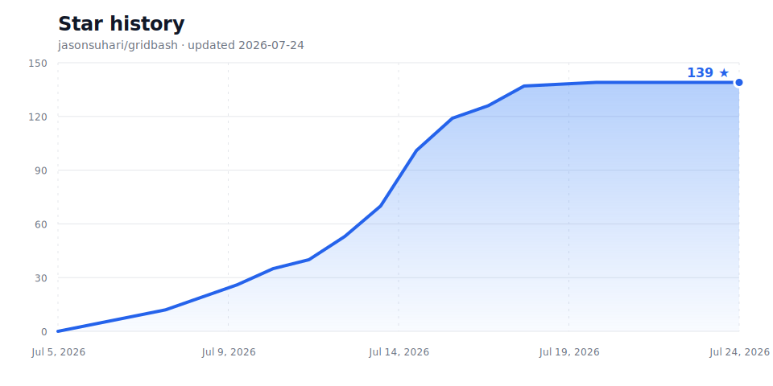

# GridBash

[](https://github.com/jasonsuhari/gridbash/actions/workflows/ci.yml)
[](https://www.npmjs.com/package/gridbash)
[](https://www.npmjs.com/package/gridbash)
[](https://github.com/jasonsuhari/gridbash/releases)
[](LICENSE)
[](https://github.com/jasonsuhari/gridbash)

**The sexiest way to tokenmaxx.**

GridBash by Jason Suhari is a cross-platform Rust TUI for agent-heavy development. Launch Codex, Claude, Gemini, Aider, OpenCode, Goose, Amp, Cursor, Copilot, your native shell, or any custom command into a real PTY grid, then select exactly which panes receive your prompt. Spawn manager agents that can do the prompting for you, or talk to your agents via Voice Mode.

Official site: [jasonsuhari.github.io/gridbash](https://jasonsuhari.github.io/gridbash/)

[](https://github.com/jasonsuhari/gridbash/blob/main/docs/assets/gridbash-launch-teaser.mp4)

GridBash is built for developers who want parallel CLI-agent work without juggling terminal windows, browser tabs, or accidental cross-pane input.

> V1 is intentionally single-process. Closing GridBash closes its child agents. Daemon detach/reattach is the next major frontier.

## Quickstart

Install the published package on Windows x64, Linux x64/arm64, or macOS 13+
(Apple Silicon or Intel):

```powershell
npm install -g gridbash
gridbash
```

Open a focused CLI-agent grid:

```powershell
gridbash 2x3 --profile codex
```

Launch every pane in a separate repo-local git worktree:

```powershell
gridbash 2x3 --profile codex --worktrees
```

## Why Developers Try It

- Run up to 100 PTY-backed panes from one terminal process.
- Send input to one pane, selected panes, or every pane in the grid.
- Start panes in isolated repo-local git worktrees for safer parallel agent work.
- Use modeless Alt shortcuts and mouse selection without leaving normal terminal mode.
- Launch common CLI agents with built-in profiles for Codex, Claude, Gemini, Aider, OpenCode, Goose, Amp, Cursor, and Copilot.

## What GridBash Is For

GridBash is for CLI agent orchestration in the terminal: compare ideas from multiple coding agents, run review/build/test loops in parallel, keep shells visible, and send a prompt only to the panes that should receive it.

Its niche is PTY-backed, agent-first terminal grids on Windows, Linux, and
macOS. Traditional terminal multiplexers are still great; GridBash focuses on
the workflows that appear when Codex, Claude, Gemini, Aider, and other CLI
agents are all part of the same development session.

## Release Status & Devlogs

- Latest npm version is shown by the npm badge above and on the npm package page.
- Latest GitHub release is shown by the GitHub release badge above and on the GitHub Releases page.
- Devlogs live in `docs/devlogs/`.
- Versioned release notes live in `docs/releases/` and are used for GitHub release notes.
- npm packages include `docs/devlogs/` and `docs/releases/` so published package contents carry the logs too.
- The [v1.0 acceptance checklist](docs/V1_ACCEPTANCE.md) defines the stable-release gates.
- The [daemon architecture proposal](docs/DAEMON_ARCHITECTURE.md) defines the detach/reattach direction beyond v1.

## Star History

[](https://github.com/jasonsuhari/gridbash/stargazers)

_Refreshed daily by the [Star History workflow](https://github.com/jasonsuhari/gridbash/actions/workflows/star-history.yml). Click the chart to see the current stargazers._

## Highlights

- Real PTY-backed panes through Windows ConPTY or Unix PTYs via `portable-pty`.
- Up to 100 panes in one terminal process.
- Multiple tabbed grids in one terminal process.
- Configurable default terminal profile: Git Bash, PowerShell, cmd, agents, or custom.
- Pane-contained drag selection that copies selected terminal text without crossing into sibling panes.
- Sleeping panes stay visually hidden until hovered, then wake without crossing input into other panes.
- Normal terminal keys pass through to the focused pane, or to selected panes when multiple panes are selected.
- Modeless Alt shortcuts for pane focus, selection, rename, settings, grid manager goals, and quit.
- Grid manager goals review live pane output and route targeted follow-ups across the current grid.
- Compact dark theme with focus, selection, sleep, exit, usage, and quiet-output cues.
- Pane headers show live terminal activity, with a configured manager goal taking priority.
- Built-in launch profiles for common CLI coding agents.
- Startup dimension picker with a live grid preview.
- `gridbash resume` for reopening prior grids with per-pane command and output context.
- Optional managed git worktrees so every pane can work in an isolated checkout.

## Demo Assets

- Watch the 13-second launch teaser: [`docs/assets/gridbash-launch-teaser.mp4`](https://github.com/jasonsuhari/gridbash/blob/main/docs/assets/gridbash-launch-teaser.mp4).
- Watch the OpenVid-style demo: [`docs/assets/gridbash-openvid-demo.mp4`](https://github.com/jasonsuhari/gridbash/blob/main/docs/assets/gridbash-openvid-demo.mp4).
- Rebuild the teaser from its HyperFrames source in [`docs/demo/gridbash-launch-teaser/`](docs/demo/gridbash-launch-teaser/).
- See the source scene and OpenVid recreation recipe in [`docs/demo/openvid-gridbash-demo.md`](https://github.com/jasonsuhari/gridbash/blob/main/docs/demo/openvid-gridbash-demo.md).
- Use [`docs/assets/gridbash-social-preview.png`](docs/assets/gridbash-social-preview.png) as the GitHub social preview image.
- Use the ready-to-post copy and publication sequence in [`docs/LAUNCH_KIT.md`](docs/LAUNCH_KIT.md).

## Install From This Repo

For local development installs:

```powershell
npm run install:local
```

Then run GridBash from anywhere:

```powershell
gridbash
```

Build a publishable npm tarball:

```powershell
npm pack
```

The package ships a small Node command shim and downloads only the native package for the current OS and architecture.

Release automation and devlog workflow are documented in `docs/RELEASING.md`.

Use `npm run install:local` for local development installs. It installs from a packed tarball so the global `gridbash` command points at a stable package copy, not whichever `.worktrees/` checkout last ran `npm install -g .`.

## PR Workflow

Pull requests can be merged directly after they have been reviewed. Before merging, check the diff, confirm the intent is clear, and make sure the relevant validation has passed.

## Install From Source

Install Rust first. On Windows:

```powershell
winget install --id Rustlang.Rustup -e
```

On macOS:

```bash
xcode-select --install
curl --proto '=https' --tlsv1.2 -sSf https://sh.rustup.rs | sh
```

On Debian or Ubuntu Linux, install the native build prerequisites before Rust:

```bash
sudo apt-get install build-essential pkg-config libasound2-dev cmake clang
curl --proto '=https' --tlsv1.2 -sSf https://sh.rustup.rs | sh
```

Build GridBash:

```powershell
git clone https://github.com/jasonsuhari/gridbash
cd gridbash
cargo build --release
```

The executable is `target\release\gridbash.exe` on Windows or
`target/release/gridbash` on Linux and macOS. On Windows:

```text
target\release\gridbash.exe
```

## Use

Open the startup grid picker:

```powershell
gridbash
```

When launched through the npm command on Windows, GridBash inherits the invoking
shell for new panes: PowerShell launches PowerShell, PowerShell 7 launches
`pwsh`, cmd launches cmd, and Git Bash launches Git Bash. Linux defaults to bash
and macOS defaults to zsh. Use `--profile` or `GRIDBASH_PROFILE` to override the
platform default.

If the invoking shell cannot be detected and no default profile is configured, GridBash opens an animated setup screen and asks you to choose from the detected terminal profiles. The choice is saved to:

```text
%APPDATA%\GridBash\config.toml
```

The startup picker asks for rows and columns, updates the preview grid as you change them, and launches every pane in the directory where you started `gridbash`.

Set the fallback terminal profile used when shell inheritance is unavailable:

```powershell
gridbash --set-default powershell
```

Open a specific grid:

```powershell
gridbash 2x3 --profile git-bash
```

Open 12 panes and auto-arrange them:

```powershell
gridbash --count 12 --layout auto --profile claude
```

List detected profiles:

```powershell
gridbash --list-profiles
```

Resume a prior grid:

```powershell
gridbash resume
```

Resume the latest saved grid without prompting:

```powershell
gridbash resume --latest
```

List saved sessions or resume a specific id:

```powershell
gridbash resume --list
gridbash resume <session-id>
```

Start in a repo:

```powershell
gridbash 3x4 --profile codex --cwd C:\Users\Jason\Documents\GitHub\fluent
```

Passing grid, count, profile, or cwd arguments bypasses the startup picker and uses the direct launch path.

GridBash saves bounded session snapshots to local app data as you launch and exit grids. A resumed session restores the grid dimensions, pane profiles, working directories, labels, worktree names, and a pane-local history view with recent submitted commands and output. It relaunches child terminals; it does not reattach still-running processes or replay old commands into shells.

Launch every pane in a separate repo-local git worktree:

```powershell
gridbash 2x3 --profile codex --worktrees
```

With `--worktrees`, GridBash creates or reuses `.worktrees/gridbash-<base>-NN` folders and `gridbash/<base>-pane-NN` branches. Panes keep the same relative folder as the directory where you launched GridBash, so starting from `repo\app` opens each terminal in the matching `app` folder inside its managed worktree. GridBash refuses this mode outside a git repo or when tracked changes are present in the base checkout.

You can also run `gridbash --worktrees` and choose the grid dimensions in the startup picker.

## Agent Control MCP

GridBash can expose a local, opt-in control API for agents running inside its panes:

```powershell
gridbash --agent-api 2x3 --profile codex
```

When enabled, child panes receive `GRIDBASH_CONTROL_ADDR`, `GRIDBASH_CONTROL_TOKEN`, and `GRIDBASH_PANE_INDEX`. Configure an agent MCP server command to run:

```powershell
gridbash --mcp
```

The MCP server exposes:

- `gridbash_show_image` to display a local png, jpg, gif, or webp in a GridBash overlay.
- `gridbash_send_command` to send command text to one or more 1-based pane numbers.
- `gridbash_set_status` to update the GridBash status bar.

The control API binds to localhost, uses a per-session token, and is off by default.

## Startup Picker Controls

| Input | Action |
| --- | --- |
| Left / Right | Switch between rows and columns |
| Up / Down | Increase or decrease the active dimension |
| r / c | Select rows or columns |
| 1-9 / 0 | Set the active dimension directly, with 0 meaning 10 |
| Enter | Launch the grid |
| Esc / q | Quit |

## Controls

GridBash captures drag selection so selected text stays inside the pane where the drag started. Releasing the drag sends the selected terminal text to the host clipboard through the standard OSC 52 terminal clipboard sequence. App controls use Alt shortcuts and do not require switching modes.

| Input | Action |
| --- | --- |
| Drag mouse | Select/copy terminal text within the source pane |
| Right-click pane | Toggle that pane in or out of the selected set |
| Mouse wheel | Scroll only the pane under the pointer; selected panes use GridBash scrollback |
| Alt+Left / Alt+Right | Focus previous / next pane in the row, wrapping at row edges |
| Alt+Up / Alt+Down | Focus pane above / below in the column, wrapping at column edges |
| Alt+l | Open the grid resizer; Enter applies the chosen dimensions and Esc cancels |
| Alt+n | Open the startup picker and launch a new tab |
| Alt+t | Switch to the next tab |
| Alt+s | Toggle focused pane selection |
| Alt+a | Select all panes, or clear selection when all panes are selected |
| Alt+c | Expand and focus the command line, or close it when focused |
| Alt+Shift+V | Listen for one dictated utterance; press again to cancel |
| Alt+h or F1 | Open or close the in-app help and shortcut legend |
| Alt+p | Open the focused-pane activity summary; use Up/Down and Enter to navigate its controls |
| Alt+Shift+p | Open the previous panes list |
| Alt+r | Rename the focused pane |
| Alt+Shift+r | Rename the current tab |
| Alt+Shift+t | Restart exited focused pane; when multiple panes are selected, restart exited selected panes |
| Alt+z | Put the focused pane to sleep; when multiple panes are selected, sleep the selected panes |
| Alt+g | Create or edit the current grid's manager goal |
| Alt+u | Stop the current grid's manager goal |
| Hover sleeping pane | Wake the pane and make its terminal contents visible again |
| Alt+o | Open settings |
| Alt+q | Quit |

The focused-pane activity summary includes auth, rename, refresh, sleep/wake,
and manager-goal controls for the current grid. Use `Up`/`Down` to select a
control and `Enter` or `Space` to use it. The direct shortcuts remain available:
`n` renames, `r` refreshes the activity snapshot, `z` sleeps or wakes the pane,
`g` creates or edits the grid goal, and `u` stops it. The grid manager reviews
relevant live panes and sends each follow-up only to its validated awake,
running targets.

Each pane's top border shows its latest activity summary instead of repeating
the folder, branch, and launch profile. When a grid manager goal is set, its
objective takes that spot across the grid until the goal is removed.

Press `Esc`, `q`, or `Alt+p` to close the activity summary, or `Alt+o` to switch
to overall settings.

When the focused pane has exited, GridBash shows a recovery dialog. Press `Enter`,
`r`, or `t` to restart it, or press `z` to put it to sleep. `Alt+Shift+t` restarts
exited target panes directly.

Typing goes to selected panes whenever multiple panes are selected. With zero or one pane selected, input goes to the focused pane. Alt+C expands and focuses the command line with its captured output visible; typing stays in the command bar, and Enter runs the command from the cwd shown in the prompt. Press Alt+C again to close it and return input to the pane grid.

The grid resizer uses the same row-and-column picker as startup, with active cells
shown in blue. Shrinking removes live panes outside the retained upper-left
rectangle. For example, changing 3x3 to 3x2 deactivates the full rightmost column.

Voice mode uses modern Windows dictation on Windows, Apple Speech on macOS, and
offline Whisper transcription on Linux.
`Alt+Shift+V` to listen for one utterance; GridBash waits up to 15 seconds for speech.
The transcript is inserted into the command bar or the panes that were targeted
when listening started. GridBash never presses Enter for dictated text, so you can
review or edit it before submitting. Press `Alt+Shift+V` while listening to cancel.

Voice audio is processed by Microsoft's online speech service. Enable **Online
speech recognition** in Windows Settings under **Privacy & security > Speech**,
allow desktop apps to access the microphone, and install the Windows speech
language pack matching the desired dictation language. If any requirement is
missing, GridBash reports the Windows dictation error instead of inserting text.

On macOS, GridBash asks for Speech Recognition and Microphone permission on
first use. It prefers on-device recognition and uses Apple's authorized speech
service when the current locale does not support local recognition.

On Linux, the first voice shortcut explains that a 57 MiB offline model is
required; press the shortcut again to approve the one-time download. The model
is checksum-verified and stored in the local XDG data directory. Audio remains
on the machine. Set `GRIDBASH_VOICE_MODEL` to use another local Whisper model,
or `GRIDBASH_SPEECH_HELPER` to override the packaged helper. Microphone capture
uses ALSA and may require granting device access in containers or remote sessions.

## Terminal Compatibility

GridBash targets modern UTF-8, ANSI/xterm-compatible terminals, including
Windows Terminal, Apple Terminal, iTerm2, GNOME Terminal, Konsole, Kitty,
WezTerm, and Alacritty. It also works through SSH and tmux when the remote
session advertises a color-capable `TERM`. `TERM=dumb` and Linux kernel consoles
are not supported. Use `--no-mouse` when a terminal, serial link, or multiplexer
does not forward mouse reporting; keyboard navigation remains available.

Renamed pane headers replace the numeric prefix for the current session. Saving a blank name restores the default number.

Settings includes a General tab for local runtime display controls and an Auth tab for GridBash-wide Claude/Codex auth defaults and launch policy. Pane Activity lets each Claude or Codex pane select its own compatible auth account; applying a different account restarts only that pane.

Pane titles add a small quiet-output marker after roughly three seconds without output. The marker means a pane produced output and then went idle; it does not mean the process exited or completed its task.

Settings persist compact titles, activity badges, quit confirmation, scrollback
for newly launched panes, refresh delay, workload policy, todo prompts, and the
accent/focus/selected/quiet/exited palette. Changes apply immediately when the
runtime supports it and remain active after restart.

## Auth Profiles

GridBash can launch Claude and Codex with isolated auth/config directories. It discovers profiles from:

```text
GRIDBASH_AUTH_HOME > [auth].home > CLAUDE_PROFILES_HOME (legacy) > %USERPROFILE%\.gridbash-auth
```

Claude profiles launch with `CLAUDE_CONFIG_DIR=<profile-dir>`. Codex profiles launch with `CODEX_HOME=<profile-dir>`.

The default home changed from `%USERPROFILE%\.claude-profiles` to `%USERPROFILE%\.gridbash-auth`. Existing profiles are not moved automatically. Move them to the new directory, set `[auth].home` to the old directory, or keep using the legacy `CLAUDE_PROFILES_HOME` override.

Auth assignment is manual by default. In manual mode, new panes use the configured default for their agent kind and keep any per-pane selection. When auto-cycle is enabled, new compatible panes are assigned round-robin across ready auth profiles of the matching kind. Changing the policy does not restart panes that are already running.

Auth settings controls:

| Input | Action |
| --- | --- |
| Tab | Switch Settings tabs |
| Up / Down | Move through auth profiles |
| d | Set selected profile as the GridBash-wide default for its kind |
| c | Toggle manual assignment / auto-cycle for new panes |
| n | Create a profile directory |
| l | Open the selected profile's login command |
| r | Refresh local account and usage status |
| Esc / q | Close settings |

For a Claude or Codex pane, open Pane Activity with `Alt+p`, use Up/Down to select the auth control, use Left/Right to choose a compatible auth profile, and press Enter to apply it and restart that pane. Press `r` there to refresh the activity snapshot.

Usage status is best-effort. GridBash reads local auth metadata, masks account emails, and uses short-timeout `curl.exe` (Windows) or `curl` (macOS) requests only while the Auth settings view is refreshed.

## Profiles

Built-in terminal profile keys are platform-specific:

```text
Windows: git-bash pwsh powershell cmd
macOS:  zsh bash fish sh pwsh
Linux:  zsh bash fish sh pwsh
```

Run `gridbash --list-profiles` for a diagnostic table showing the selected
default, built-in versus custom source, availability, resolved executable, or an
actionable missing-command reason. This command never prints profile environment
values, auth tokens, or manager credentials.

Agent profile keys remain available on every platform: `codex`, `claude`,
`gemini`, `opencode`, `aider`, `amp`, `goose`, `copilot`, and `cursor`.

GridBash resolves Windows `.exe` and `.cmd` shims before extensionless npm shims, so common Node-based CLIs launch correctly.

Optional config file:

```text
%APPDATA%\GridBash\config\config.toml
```

Example:

```toml
[defaults]
profile = "powershell"
# Use "normal" to opt out of GridBash's desktop-responsiveness safeguard.
pane_priority = "below-normal"
# Use "unrestricted" to disable adaptive CPU sharing between pane workloads.
pane_workload = "adaptive"

[manager]
endpoint = "https://api.openai.com/v1/chat/completions"
model = "gpt-4o-mini"
api_key = "sk-..."

[auth]
home = "C:\\Users\\Jason\\.gridbash-auth"
auto_cycle = false
usage_status = true

[auth.defaults]
claude = "claude-1"
codex = "codex-2"

[profiles.review]
command = "codex"
args = ["--model", "gpt-5.5"]
title = "Codex Review"
agent_kind = "codex"
```

Then run:

```powershell
gridbash 2x4 --profile review
```

Default profile resolution order:

```text
--profile > GRIDBASH_PROFILE > [defaults].profile > platform default
```

The platform default is Git Bash on Windows, zsh on macOS, and bash on other
Unix systems. In Apple Terminal or iTerm2, configure Option as the Meta/Alt key
so GridBash's Alt shortcuts reach the TUI.

GridBash keeps its own interface at normal Windows process priority, while pane
processes default to `below-normal`. Child workloads such as parallel compilers
normally inherit that priority, which keeps input and other desktop apps responsive
when many panes are busy. On Windows, the default `adaptive` pane workload policy
also gives focused and selected panes more CPU time than hidden or sleeping panes
when the system is contested; every pane continues running. Set
`[defaults].pane_workload = "unrestricted"` to disable adaptive sharing, or change
the Workload policy under Performance settings while GridBash is running.

The grid manager uses the OpenAI-compatible chat-completions endpoint, model, and
API key under `[manager]`. These values can also be edited from the Manager tab in
GridBash settings; the key is masked in the UI and stored in the local GridBash
config. Press `Alt+g` or use focused-pane activity controls to create a goal for
the current grid. Reviews include pane-numbered output, and validated follow-ups
remain bound to their intended PTYs when panes are reordered.

Starting a grid goal sends pane role/folder metadata and bounded recent output
from every awake pane in that grid to the configured manager API. Sleeping and
exited panes are never command targets, and their output is omitted from reviews.

## Design Goals

GridBash is inspired by agent-first multiplexers such as Mato and terminal workspaces such as Zellij, but takes a different path: native PTYs, visual selection, scoped multi-pane input, and a hard bias toward fast multi-agent grids.

## Community

- Read `CONTRIBUTING.md` before opening a pull request.
- See [`docs/AUTOMATED_REVIEW.md`](docs/AUTOMATED_REVIEW.md) for the automatic
  pull request review agent, security model, and optional managed alternatives.
- See `docs/ROADMAP.md` for the release roadmap.
- Use GitHub Issues for actionable bugs, tasks, and feature requests.
- Use GitHub Discussions for questions, ideas, and longer design conversation.
- Follow `SECURITY.md` for private vulnerability reports.

## Legacy Launcher

The old Windows Terminal launcher is still useful for quick split-pane grids, but it cannot support true subset pane input because Windows Terminal does not expose subset pane selection. The Rust app is the path forward.
